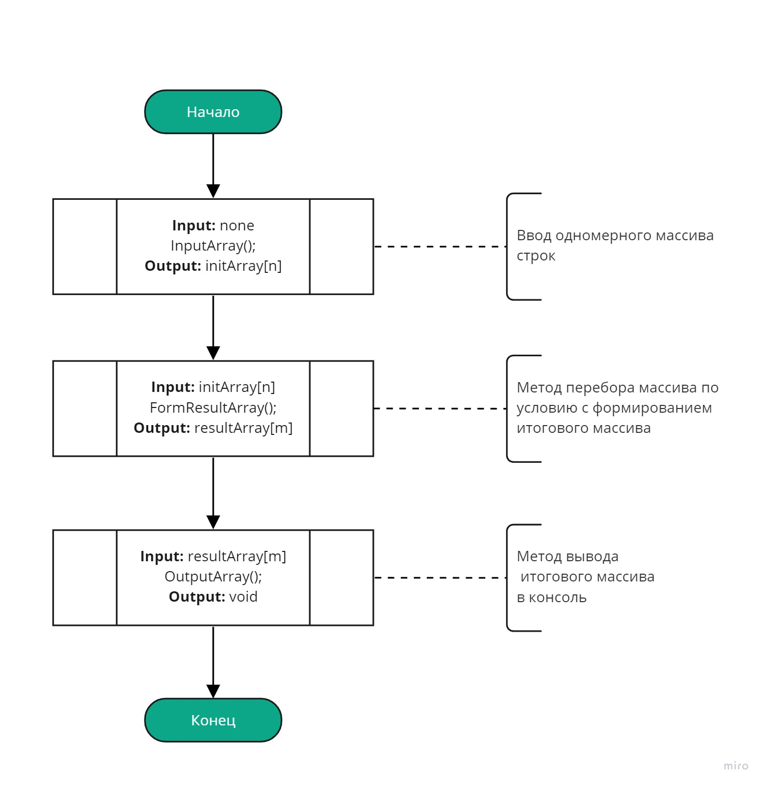

# Итоговая проверочная работа по 1 блоку курса "Разработчик"

## Содержание работы:

1. Создать репозиторий на GitHub
2. Нарисовать блок-схему алгоритма (можно обойтись блок-схемой основной содержательной части, если вы выделяете ее в отдельный метод)
3. Снабдить репозиторий оформленным текстовым описанием решения (файл README.md)
4. Написать программу, решающую поставленную задачу
5. Использовать контроль версий в работе над этим небольшим проектом (не должно быть так, что все залито одним коммитом, как минимум этапы 2, 3 и 4 должны быть расположены в разных коммитах)

### **Задача :**

> Написать программу, которая из имеющегося массива строк формирует массив из строк, длина которых меньше либо равна 3 символа. Первоначальный массив можно ввести с клавиатуры, либо задать на старте выполнения алгоритма. При решении не рекомендуется пользоваться коллекциями, лучше обойтись исключительно массивами.

> **Примеры:**

> `["hello", "2", "world", ":-)"]` -> `["2", ":-)"]`

> `["1234", "1567", "-2", computer science"]` -> `["-2"]`

### **Решение :**

1. Создан репозиторий по адресу: https://github.com/SemyIgor/ResultWork_01.git

2. Нарисована блок-схема алгоритма с учётом использования вызываемых методов. Её описание изложено в этом разделе.

   - **Основной метод.** Состоит из трёх основных блоков

     1. блок ввода массива (может осуществляться различными методами)
     2. блок метода формирования массива по условию
     3. блок печати массива
     4. 

   - **метод формирования массива согласно условию задачи.**

     1. Получает на вход исходный одномерный массив строк.
     2. В цикле перебирает полученный массив, сохраняя элементы, соответствующие заданному условию, в новый (временный) массив, синхронно увеличивая счётчик отобранных элементов `(если в исходном массиве есть строки нулевой длины, то они также исключаются)`.
     3. Создаёт итоговый одномерный массив строк, имеющий размер, определяемый полученной в предыдущем пункте величиной счётчика элементов.
     4. В новом цикле заполняет итоговый массив элементами из временного массива, при этом количество передаваемых в результирующий массив элементов ограничивается величиной счётчика элементов.
     5. Выдаёт в качествы выходного параметра полученный массив.
     6. 

   - **метод печати массива.**

     1. Выводит в консоль открывающую скобку начала массива.
     2. В цикле выводит каждый, кроме последнего, элемент массива с отделяющей его запятой
     3. Выводит последний элемент массива и закрывающую скобку окончания массива.
     4. 

3. Написана программа по данному алгоритму.
4. Оформил ввод массива отдельным методом.
